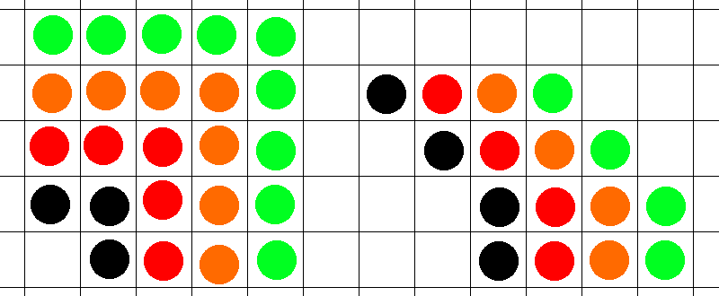

# Architecture

## Units

All distances in the app are in terms of a constant `u = 56px`.
The padding unit is defined as `p = u/8 = 6px`.

## Infinite Grid

The application lays on top of an infinte grid.
Elements are placed into the cells formed by this grid.
Each cell is a square, with side length `u+p`.
The single `p` is to allow for a shared `p/2` padding on each side of lines.

Each grid cell may contain the following (any of these may be omitted):

- Background tile (exactly 0-1)
- Line (any number)
- Station (exactly 1)

## Lines

Lines have a *color* and a *bullet*.

The internal representation of a line is a series of vertically/horizontally/diagonally-adjacent dots.
Lines may cross other lines, both on the same cell and off.
A line is considered to be curved if the cells forming the line either:

- make an L-shape (i.e. 90 degree turn), or
- are diagonally adjacent (45 degree turn)

Visually, lines are exactly `1u` in width, with `p/2` white padding on each side.
When turning, the innermost line has the following radiuses:

|Turn|Inner Radius|Outer Radius|
|-|-|-|
|90 deg|`1/2u = 24px`|`4/3u = 64px`|
|45 deg|`2/3u = 32px`|`4/3u = 64px`|

The ends of lines have diameter `1/2u = 24px` (the station bullet is the end of the line).

When multiple lines are parallel, the white padding overlaps, leaving a total gap of `1p`

## Stations

- Stations always have 1 *label*
- Stations may be connected by multiple *lines*
- Stations may have multiple *bullets*, 1 per line connected
- Station bullets are `1u` in diameter
- Bullets may be:
  - Black circle + white text: always stops
  - Black-outlined white cirle + black text: limited service. White circle, with inner black outline `u/`
  - Empty: does not stop
- Transfer possiblilites:
  - Black rectangle: for adjacent stations. `1/2 u` wide.
  - White rounded shape: for close-but-non-adjacent stations.
  - Small black line: for distant stations. `1p` wide
  - Dotted black line: out-of-station transfer. `1p` wide, with rounded dots `1p` diameter spaced `TODO p` apart

## Other Rail

- Has width of `1/2u = 4p`
- Consists of white and gray stripes, each `1/4u = 1/2p`: white, gray, white, gray, gray, white, gray, white
- Stations on other rail has inner diameter `3p` with `1/4p` white outline
- Turning radiuses are identical to lines

## Background

- Background is a grid of tiles
- Tiles will smoothly connect with other tiles, especially at 45 degrees
- Tile types
  - Land (white)
  - Land (tan)
  - Water
  - Beach
  - Park
  - Border

## Colors

- Preset colors are all colors included on the MTA map
- [Trunk line colors](https://en.wikipedia.org/wiki/New_York_City_Subway_nomenclature#Colors_and_trunk_lines)
- Take other colors from color-picking on the map

## Themes

- Themes based on the 3 maps (day, night, winter)
- Background colors change 1-to-1 between themes
- Text is white on night map