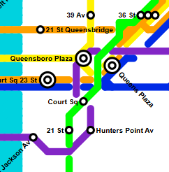
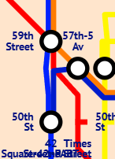
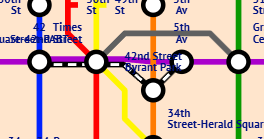
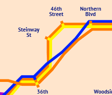
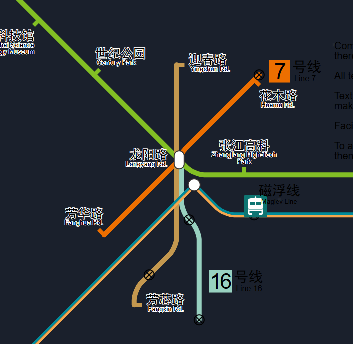
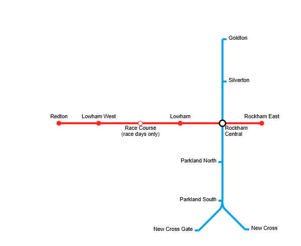

# Grievances

## <https://metromapmaker.com/>

- grid + 45deg diagonals
- lines are colored, but no bullets
- plenty of line styles
- stations are separate from lines
- erasing stations also erases part of the line
- making transfer stations is super jank
- doesn't handle lines crossing well (forced discontinuity in the line)
- can't move stations without delete+replace
- everything is manual
- no NYC-style stations
- feels jank

## <https://tennessine.co.uk/metro/>

- grid + 45deg diagonals
- stations are points on the map
- lines are connections between stations; i.e. separate from stations
- transfer stations are just a visual style; auto-set by having multiple lines connect to the same station
- pathing of lines is easily editable; but, can be jank sometimes and are limited to the grid
- only 1 style: London Underground
- no distinguishing of different services on physical lines, e.g. express skipping a station
- transfer stations don't show what lines connect to a station
- long-distance transfers need workarounds
- can generate map key
- labels often overlap each other (hard problem?)
- auto label placement is appreciated

## <https://railmapgen.github.io/> Rail Map Painter

- lots of chinese metro stuff
- not grid-based
- very complicated, it seems. exposes a lot of things to be edited
- feels pretty weird. need to play with it more.

## <https://beno.uk/metromapcreator/>

- feels extremely old
- only london underground
- nah

