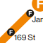
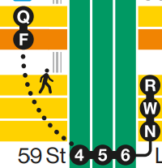
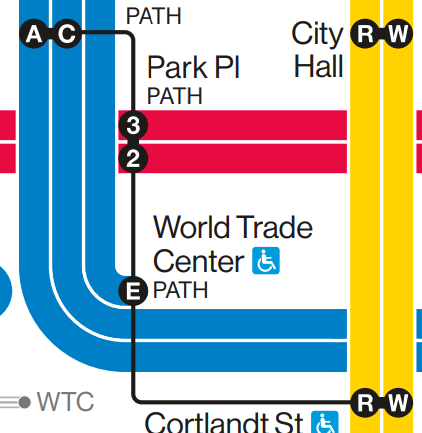
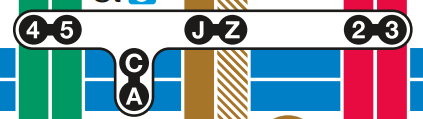
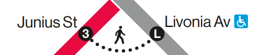
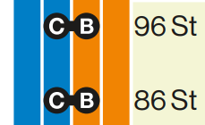

# vig-metro-map

## Goal

This project is to be a metro map maker that *specifically* does NYC Subway 2025 Vignelli-styled maps bullets.

## (Desired) Features

### Units

- Lines have an arbitrary width `u = 48px`
- Lines are separated by padding units, where `p = u/8 = 6px` (`1u + 1p = 9p = 54px`)

### Lines

- Lines have a *color* and a *bullet*
- Lines are `1u` in width, with 
- Lines can turn in 45-degree increments
- 90-degree turns:
  - The inner radius of the innermost line is `1/2u = 24px`
  - The outer radius of the innermost line is `4/3u = 64px`
- 45-degree turns:
  - The inner radius of the innermost line is `2/3u = 32px`
  - The outer radius of the innermost line is `4/3u = 64px`
- Ends of lines have radius `1/2u = 24px` (the station bullet is the end of the line)
- Lines have a white padding of `1p` around both sides of the line
- When multiple lines are parallel, the white padding overlaps, leaving a gap of `1p`

### Stations

- Stations always have 1 *label*
- Stations may be connected by multiple *lines*
- Stations may have multiple *bullets*, 1 per line connected
- Station bullets are `1u` in diameter
- Bullets may be:
  - Black circle + white text: always stops
  - Black-outlined white cirle + black text: limited service. White circle, with inner black outline `u/`
  - Empty: does not stop
- Transfer possiblilites:
  - Black rectangle: for adjacent stations. `1/2 u` wide.
  - White rounded shape: for close-but-non-adjacent stations.
  - Small black line: for distant stations. `1p` wide
  - Dotted black line: out-of-station transfer. `1p` wide, with rounded dots `1p` diameter spaced `TODO p` apart

### Other Rail

- Has width of `1/2u = 4p`
- Consists of white and gray stripes, each `1/4u = 1/2p`: white, gray, white, gray, gray, white, gray, white
- Stations on other rail has inner diameter `3p` with `1/4p` white outline
- Turning radiuses are identical to lines

### Background

- Background is a grid of tiles
- Tiles will smoothly connect with other tiles, especially at 45 degrees
- Tile types
  - Land (white)
  - Land (tan)
  - Water
  - Beach
  - Park
  - Border

### Colors

- Preset colors are all colors included on the MTA map
- [Trunk line colors](https://en.wikipedia.org/wiki/New_York_City_Subway_nomenclature#Colors_and_trunk_lines)
- Take other colors from color-picking on the map

### Themes

- Themes based on the 3 maps (day, night, winter)
- Background colors change 1-to-1 between themes
- Text is white on night map

## Official MTA Map Specimens

