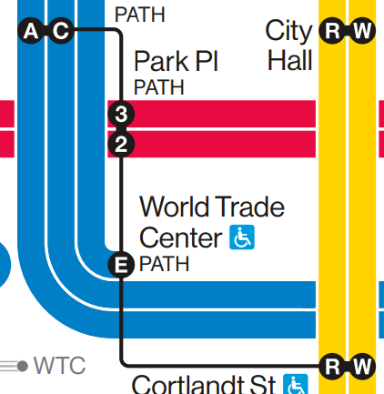
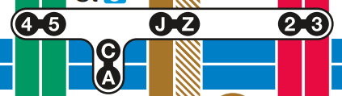
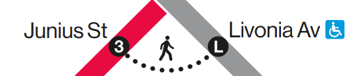
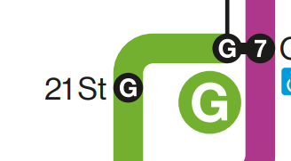

# vig-metro-map

## Goal

This project is to be a metro map maker that *specifically* does NYC Subway 2025 Vignelli-styled maps bullets.

## Official MTA Map Specimens

## Sources

- Grid code from <https://www.sandromaglione.com/articles/infinite-canvas-html-with-zoom-and-pan> and <https://github.com/SandroMaglione/infinite-html-canvas>
- V train favicon adapted from <https://commons.wikimedia.org/wiki/File:NYCS-bull-trans-V.svg> (Flamurai, Public domain, via Wikimedia Commons)
  - generated by <https://realfavicongenerator.net/>
- General inspiration from <https://tennessine.co.uk/metro/>